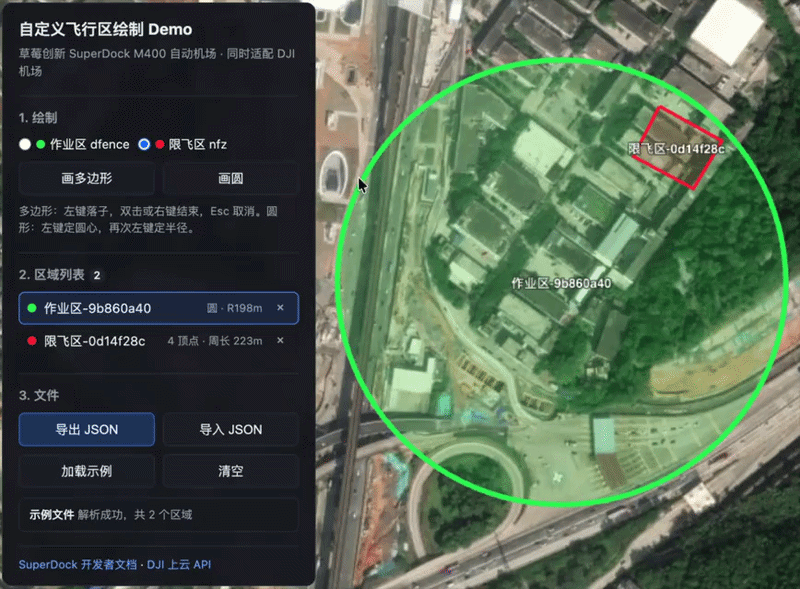

# Custom Flight Area Drawing Demo — SuperDock M400

> [Live demo](https://sb-im.github.io/demo-custom-flight-area/) · [中文](./README.md)

This is a custom flight area drawing demo for the **SuperDock M400** automated dock by
[StrawBerry Innovation](https://sb.im). It draws operation areas and restricted zones on a map and
imports or exports `geofence_{md5}.json` files. Files generated by this project have been verified
on a real SuperDock M400.

The file format follows the DJI Cloud API custom flight area protocol and can also serve as a
reference for DJI Dock integrations. Consult DJI's documentation for model and firmware support.



- **Operation area `dfence`**: the aircraft can operate only inside the area and cannot cross its
  boundary.
- **Restricted zone `nfz`**: the aircraft cannot enter the area and can operate outside it.

This repository covers drawing, validation, import and export only. It contains no accounts,
backend, object storage, MQTT or device synchronization logic.

## Quick start

Node.js 20 is required.

```bash
npm ci
npm run dev        # http://localhost:5173
npm test           # unit tests
npm run build      # type-check + production build; output goes to dist/
```

### Basemap

The basemap uses Cesium World Imagery. CesiumJS's bundled demo token works without configuration,
but is intended only for evaluation. Use your own Cesium ion token for a public or production app:

```bash
cp .env.example .env.local
# Set VITE_CESIUM_ION_TOKEN in .env.local
```

Cesium displays a warning banner while the demo token is in use. Any replacement imagery must align
with WGS84 coordinates. Convert GCJ-02 or BD-09 upstream data before writing the file.

## Usage

| Action | Description |
| --- | --- |
| Choose an area type | Select operation area `dfence` or restricted zone `nfz` |
| Draw a polygon | Left-click each vertex; double-click or right-click to finish; `Esc` cancels |
| Draw a circle | Left-click the center, move to inspect the radius, then left-click again |
| Select an area | Click the area on the map or its row in the side panel |
| Delete an area | Click the `×` on its row |
| Export JSON | Download the file and display its name, MD5, SHA-256, byte size and full JSON |
| Import JSON | Import and display a file, replacing the current area list |
| Load sample | Load the bundled sample file |
| Clear | Delete all current areas |

## Reusing it in another project

For AI-assisted integration, ask the coding agent to read [AGENTS.md](./AGENTS.md) first and copy
only the required layer:

| Goal | Files | Runtime dependencies |
| --- | --- | --- |
| Build or parse flight-area files | `src/types.ts`, `src/geometry.ts`, `src/validation.ts`, `src/geofenceFile.ts`, `src/hash.ts` | No third-party packages; modern TypeScript/ES2022 |
| Add map drawing | The files above plus `src/draw.ts`, `src/render.ts`, `src/viewer.ts` | Cesium |
| Reference the example UI | Also reference `src/main.ts`, `index.html`, `src/style.css` | Browser DOM and Cesium |

The five core files in the first row depend on neither Cesium nor the DOM and can be reused in
React, Vue or Node.js projects. Consumers may need to adapt import paths to their module system and
are responsible for converting GCJ-02, BD-09 or other upstream coordinates to WGS84.

## File format

The file is a GeoJSON `FeatureCollection`. The example below is wrapped for readability; actual
exports are compact UTF-8 JSON without a BOM:

```json
{"type":"FeatureCollection","features":[
  {"id":"9b860a40-0096-4ab4-b3f8-8bfc0689c00b","type":"Feature","geofence_type":"dfence",
   "geometry":{"type":"Point","coordinates":[114.2245,22.6857]},
   "properties":{"subType":"Circle","radius":198,"enable":true}},
  {"id":"0d14f28c-c147-4bd0-9107-496923f9f2ca","type":"Feature","geofence_type":"nfz",
   "geometry":{"type":"Polygon","coordinates":[[[114.2253,22.6872],[114.2259,22.6869],[114.2256,22.6865],[114.2251,22.6868],[114.2253,22.6872]]]},
   "properties":{"radius":0,"enable":true}}]}
```

| Field | Description |
| --- | --- |
| `id` | Stable unique area ID, preferably a UUID; device events use it to reference the area |
| `geofence_type` | `dfence` (operation area) or `nfz` (restricted zone) |
| `geometry.type` | `Point` for a circle or `Polygon` for a polygon |
| `properties.subType` | Required as `"Circle"` for circles; omitted for polygons |
| `properties.radius` | Circle radius in meters; `0` for polygons |
| `properties.enable` | Always exported as `true` by this demo |
| `coordinates` | WGS84 `[longitude, latitude]`; a polygon contains one closed outer ring |

### Protocol requirements

1. The filename must be `geofence_{file MD5}.json`, with MD5 computed from the final file bytes.
2. `files[].checksum` in `flight_areas_get` is the **SHA-256** of the same file, not the MD5 in the
   filename. `files[].size` is the byte length.
3. A circle must use `Point` + `properties.subType = "Circle"` and have a radius of at least 10 m.
4. A polygon outer ring must be closed, contain at least three distinct vertices, and contain no more
   than 255 points including its closing point.
5. Coordinates must be WGS84 `[longitude, latitude]`.
6. The current protocol version does not support disabling an area, so exports always write
   `properties.enable = true`.

MD5, SHA-256 and `size` must be calculated from the exact same final bytes. Recalculate them after
changing whitespace, field order or encoding. DJI's official template contains explanatory `//`
comments and cannot be imported directly as JSON. To reduce firmware compatibility risk, this demo
exports only documented fields. Store display names, timestamps and other application metadata
separately and associate them through the stable `id`.

### Demo validation and unsupported features

- Polygons cannot self-intersect.
- Operation areas cannot overlap. Restricted zones may sit inside an operation area, and this demo
  does not restrict overlap between restricted zones.
- `validateFlightAreaGeometry()` is the authoritative semantic validator. `buildGeofenceFile()`
  validates again before export so callers cannot bypass validation by skipping the UI.
- Import is designed for inspection and common-file compatibility, not lossless conversion.
  Unsupported features are skipped or simplified with warnings and are not restored on re-export.
- Polygon holes, MultiPolygon, no-landing zones, height ranges and `features_extend` are unsupported.
- Distance and self-intersection checks operate directly in the longitude/latitude plane, which is
  suitable for ordinary operation scales. Antimeridian and polar cases are not handled.

## Integration notes

- The dock must be inside an operation area, outside every restricted zone, and separated from each
  boundary by a safety margin. This demo has no dock position data, so the integrating system must
  perform that check before synchronization.
- `buildGeofenceFile()` sorts by `id` and serializes deterministically. The same area set therefore
  produces identical bytes and digests instead of a new file identity.
- This repository only produces the file. Implement upload, dock notification, synchronization
  progress and task safety checks according to the target device's official documentation.

## References

- [SuperDock custom flight area API](https://docs.sb.im/api-integration/api-reference/superdock-hangar/custom-flight-area)
- [DJI Cloud API: Custom Flight Area](https://developer.dji.com/doc/cloud-api-tutorial/en/feature-set/dock-feature-set/custom-flight-area.html)
- [DJI custom flight area file template](https://terra-1-g.djicdn.com/fee90c2e03e04e8da67ea6f56365fc76/SDK%20%E6%96%87%E6%A1%A3/CloudAPI/custom-flight-area-file-template.json)
- [Cesium ion Access Tokens](https://cesium.com/learn/ion/cesium-ion-access-tokens/)

## License

This project is open source under the [MIT License](./LICENSE).
